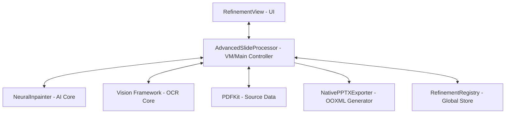

# SlideRev 技术架构与设计文档 (Technical Design)

**文档版本**: v1.1.0  
**平台**: macOS (SwiftUI)  
**架构类型**: MVVM + AI Processor  

---

## 1. 系统架构 (System Architecture)

SlideRev 采用了经典的 **Model-View-ViewModel (MVVM)** 架构，并引入了专门的 **AI Processor** 层用于处理繁重的 OCR 与图像处理任务。

### 1.1 架构组件示意图

---

## 2. 关键组件说明 (Component Glossary)

### 2.1 AdvancedSlideProcessor (核心中枢)

- **职责**：维护当前会话的 `pages` 缓存，协调 UI 指令、OCR 任务与 AI 重绘流程。
- **关键状态**：`currentPageIndex`, `recognizedItems`, `isBatchProcessing`。

### 2.2 NeuralInpainter (AI 推理引擎)

- **职责**：封装 LaMa 模型的 CoreML 实现。
- [x] **批量精炼稳定性修复 (v27.1)**：通过显式 Struct 重写和 Clean Reset 机制，解决了多页 PDF 精炼后背景失效和显示状态残留的问题。
- [x] **分层扫描动画 (v26.1)**：实现了激进的“背景先行、文本滞后”时序算法，在扫描中线创造了物理级的“空白带”。
- [x] **全链路诊断日志**：在 `AdvancedSlideProcessor` 中集成了 `[BatchCache]` 和 `[Switch]` 调试轨道，支持实时排查缓存状态。
运行，并根据硬件使用 GPU/ANE 加速。

### 2.3 NativePPTXExporter (原生导出引擎)

- **职责**：生成符合 OOXML 标准的 `.pptx` 包。
- **流程**：图片媒体文件拷贝 -> XML 结构生成 (Slide, Rels, Content_Types) -> ZIP 封装。

### 2.4 RefinementRegistry (全局状态管理)

- **职责**：管理跨页面的匹配模式（Watermark Patterns）以及用户自定义的排斥项列表。

---

## 3. 数据流转与算法 (Data Flow & Algorithms)

### 3.1 坐标系转换逻辑 (Coordinate Systems)
由于系统涉及多个不同的坐标系，转换的一致性至关重要：
- **PDFKit**: (0,0) 在左下角，单位为 Points。
- **Vision OCR**: (0,0) 在左下角，规格化为 (0..1, 0..1)。
- **UI (SwiftUI)**: (0,0) 在左上角，单位为 Points。
- **PPTX (OpenXML)**: (0,0) 在左上角，单位为 EMUs (1 Point = 12700 EMUs)。

> [!IMPORTANT]
> 系统统一使用 **Vision 规格化坐标** 作为中间存储量，并在导出阶段通过静态常数 `pointsToEMU` 进行最终转换。

### 3.2 颜色采样与字号拟合 (Styling)
- **颜色采样**：在识别文字项周围通过边缘对比算法（Edge Contrast Detection）自动采样背景色作为文字颜色。
- **动态字号拟合**：通过 `calculateFittingFontSize` 算法，在固定宽高的框体内动态计算最饱满的 Helvetica 字体字号。

### 3.3 手动重绘逻辑 (Manual Inpainting)
用户通过橡皮擦工具涂抹时，系统执行以下流程：
1. **实时采样**：根据鼠标拖拽轨迹生成规格化矩形序列 (`addEraserPatch`)。
2. **掩码合成**：在离屏画布上绘制这些矩形，生成 1-bit 的黑白掩码图 (Mask)。
3. **异步推送**：鼠标释放后 (`commitEraserStroke`)，将原图与合成掩码一同推送至 `NeuralInpainter`。
4. **结果回填**：识别结果返回后，更新 `PageState.refined.background` 并触发 UI 刷新。

> [!NOTE]
> **交互增强 (v8.0 修复)**：由于 SwiftUI (macOS) 中密集的文本框 Overlay 即使设置 `allowsHitTesting(false)` 仍可能干扰 `onContinuousHover` 信号，系统在橡皮擦模式下引入了 **“顶层透明交互层” (Top-level Tracking Layer)**。该层位于 `ZStack` 最顶端，采用 `Color.clear` 并配合 `.contentShape(Rectangle())`，强制统一捕获全域的悬停与拖拽手势，确保坐标追踪的绝对流畅。

### 3.4 重置与缓存优化 (Reset Logic)
为平衡性能与体验，`Reset` 采用“按需吊销”策略：
- **不删除物理缓存**：保留 `PageState` 对象以复用底图。
- **状态重置**：仅循环重置 `textLayers` 中的 `isErased` 和 `editedText` 标志，实现瞬间回滚。

---

## 4. 异常处理与性能 (Error Handling & Performance)

### 4.1 异步处理模型
- **渲染异步**：PDF 渲染与 OCR 识别均在 `DispatchQueue.global(qos: .userInitiated)` 中执行，防止 UI 阻塞。
- **静默流水线**：批量处理模式（Batch Mode）下，不触发 UI 属性订阅者的更新，直至任务完成。

### 4.2 缓存与持久化
- 采用 **Memory Cache (PageState)** 机制，确保百页 PDF 的状态快速检索。
- 使用 `JSONEncoder` 对 `PageSession` 进行轻量化元数据持久化，不重复保存大体积图片。

---

---

## 6. 像素级精炼 (Pixel-Perfect Refinement - v0.9.9.13)

系统在 v0.9.9.13 版本中引入了更精密的局部精炼架构，旨在提供无干扰且高度真实的重绘体验。

### 6.1 字符级局部遮罩与底图切换 (Refinement Finalization)
- **两阶段渲染架构 (Two-stage Rendering)**：
    1. **精炼进行中 (Refining Phase)**：
        - **技术实现**：利用 Vision 提取的 `charRects` 生成动态 `ErasedItemsMask`。
        - **渲染细节**：底层显示 `originalImage`，顶层通过 Mask 叠加 `inpaintedImage` 的片段。
        - **目的**：支持逐字跳变的 Staggered 动画，无需高频重建重绘图。
    2. **精炼完成 (Finalized Phase)**：
        - **触发时机**：精炼序列最后一个时延结束后，设置 `isRefinementFinalized = true`。
        - **渲染逻辑**：**底图直接切换为 `inpaintedImage`**，并将 `originalImage` 的透明度降至 0。
        - **核心优势**：一旦精炼完成，整个底板在物理上已经“变干净”了。用户拖动矢量文字项时，下方露出景物是永久重绘后的背景，彻底解决了“拖动导致原图文字露头”的架构缺陷。

### 6.2 全透明度控制 (Absolute Transparency)
- **零干扰准则**：
    - 移除了所有 `TextField` 及容器的 `padding` 和 `background`（强制 `Color.clear`）。
    - 交互层仅作为逻辑触控面存在，不携带任何像素信息。
- **视觉反馈**：仅保留 2pt 边框线，确保底图的重绘细节在编辑过程中 100% 可见。

### 6.3 极速揭示动效 (Staggered Pop Animation)
- **动效计时**：系统通过分步计时器 (`staggered delay`) 依次激活各项的 `isErased` 状态。
- **处理频率**：单页精炼时间总计被锁定在 **1.0s**。处理逻辑如下：
    - 处理项极少时：单个项间隔延长，提供节奏感。
    - 处理项极其密集时：动态缩短间隔（最低 0.015s），确保在大工作量下依然保持“流式转换”的流畅感。

### 6.4 批量处理与持久化稳定性 (Batch Refining & Sustainability - v27.1)
- **Struct 显式赋值协议**：为避免 Swift 在异步闭包中通过可选链修改 Struct 成员可能导致的 Dictionary 更新失效，系统在批量处理完成后，强制采用 `if var page = pages[index] { ... pages[index] = page }` 的 re-assignment 模式。
- **全量重置准则**：批量精炼时采用 `Clean Reset`，确保各页面的 OCR 与重绘状态不产生交叉污染。
- **诊断日志体系**：内置 `[BatchCache]` 和 `[Switch]` 追踪标签，实时映射内存缓存与 UI 显示状态。
